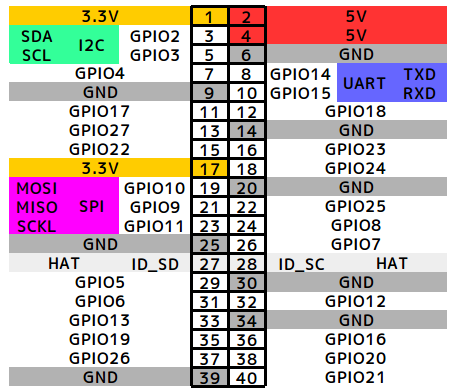
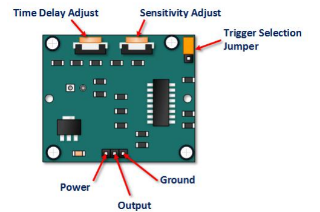

# 環境
## 開発マシン
* macOS Sonoma 14.2.1
* xquartz: 2.8.5

## Raspberry　Pi
* Raspberry Pi 3 model B
* Raspberry Pi OS with desktop
  * Release date: July 4th 2024
  * System: 64-bit
  * Kernel version: 6.6
  *Debian version: 12 (bookworm)
* Python 3.11.2

## ピンアサイン
### Raspberry Pi 3 model B

### PIR Motion Sensor

